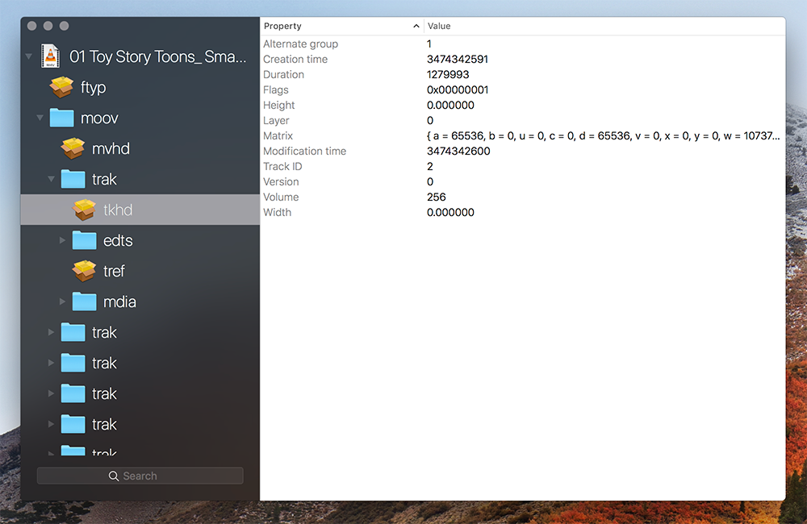

ISOBMFF-Explorer
================

  

Introspection utility for files in the ISO Base Media File Format
-----------------------------------------------------------------

**ISOBMFF-Explorer** is a macOS utility that displays the structure and data of files conforming to the «ISO Base Media File Format» standard (ISO/IEC 14496-12).

Such file formats include:

 - QuickTime (.mov)
 - MPEG-4 (.mp4, .m4v, .m4a, etc.)
 - HEIF/HEIC (.heif, .heic, etc.)
 - 3GP (.3gp)
 - ...

License
-------

**ISOBMFF-Explorer** is released under the terms of the MIT License.

Repository Infos
----------------

    Owner:          DigiDNA
    Web:            www.digidna.net
    Blog:           imazing.com/blog
    Twitter:        @DigiDNA
    GitHub:         github.com/DigiDNA
